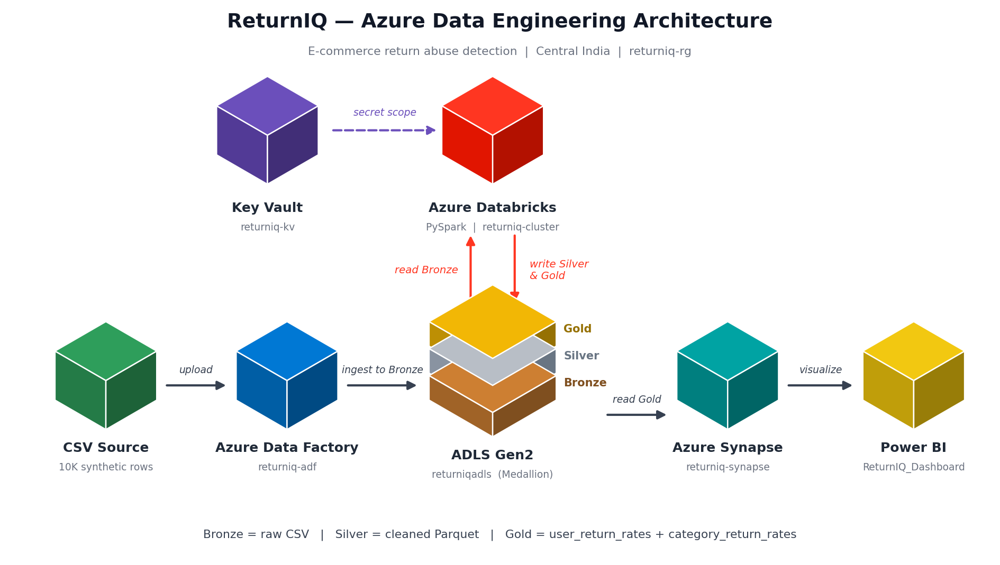
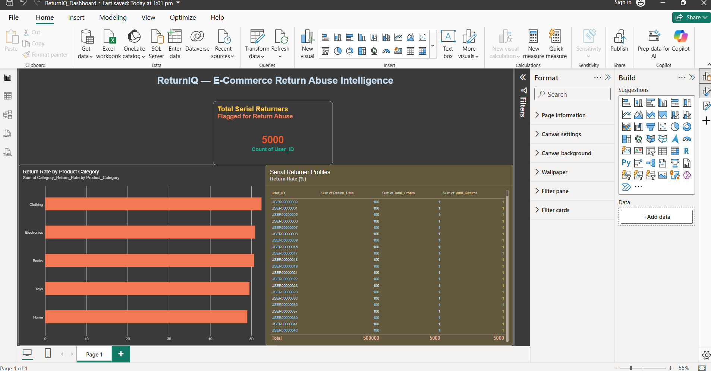
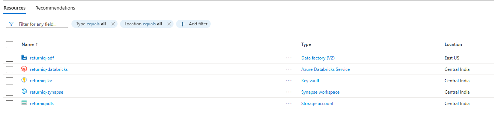
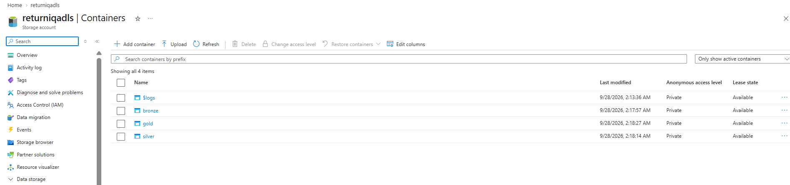
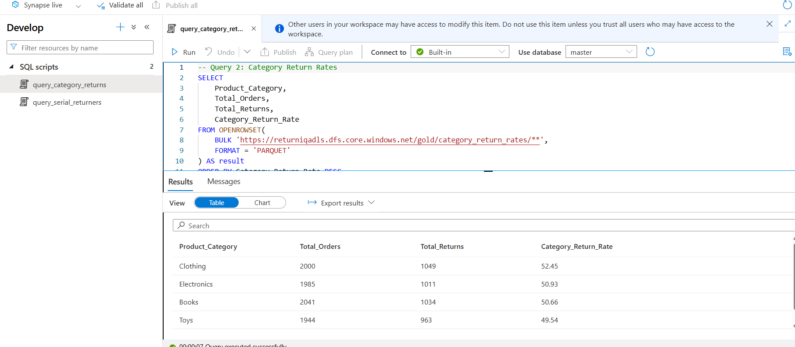
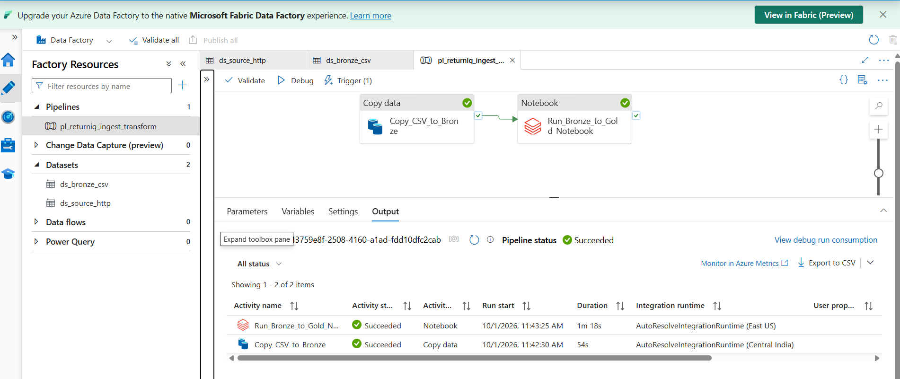

# ReturnIQ — E-commerce Return Abuse Detection (Azure Data Engineering)

An end-to-end Azure data pipeline that ingests e-commerce return data, cleans it through a Medallion architecture, and surfaces **serial returners** and **high-return categories** in a Power BI dashboard.

## Architecture



```
CSV (10K rows) → Azure Data Factory → ADLS Gen2 (Bronze → Silver → Gold)
                                          ↑
                              Azure Databricks (PySpark)
                                          ↓
                          Azure Synapse Analytics → Power BI
```

Secrets (ADLS access key) are stored in **Azure Key Vault** and read in Databricks through a secret scope — no credentials in code.

## Tech Stack

| Layer | Service |
|---|---|
| Orchestration / ingestion | Azure Data Factory (`returniq-adf`) |
| Storage (Medallion) | ADLS Gen2 (`returniqadls`) — Bronze / Silver / Gold |
| Transformation | Azure Databricks + PySpark (`returniq-databricks`) |
| Serving / SQL analytics | Azure Synapse Analytics (`returniq-synapse`) |
| Secrets | Azure Key Vault (`returniq-kv`) |
| Visualization | Power BI |

Region: Central India (Azure Data Factory deployed in East US) · Resource group: `returniq-rg`

## Data Flow

| Layer | What happens |
|---|---|
| **Bronze** | Raw `ecommerce_returns_synthetic_data.csv` (10K rows, synthetic) as-is |
| **Silver** | Cleaned and typed data, stored as Parquet |
| **Gold** | Aggregates: `user_return_rates`, `category_return_rates` |

## Repository Structure

```
returniq-azure-pipeline/
├── architecture/          # Architecture diagram
├── notebooks/
│   └── 01_bronze_to_silver.py
├── synapse_queries/
│   ├── query_serial_returners.sql
│   └── query_category_returns.sql
├── dashboard/             # Power BI file + screenshot
├── data/                  # Sample synthetic CSV
└── README.md
```

## Synapse Queries

- `query_serial_returners.sql` — flags users with unusually high return rates
- `query_category_returns.sql` — return rate by product category

## Dashboard

Power BI report (`ReturnIQ_Dashboard.pbix`) with:
- Bar chart — return rate by category
- Table — top serial returners
- Card — overall return rate



## Azure Screenshots






## Orchestration

An Azure Data Factory pipeline (`pl_returniq_ingest_transform`) copies the source CSV
from GitHub into the Bronze container, then runs the Databricks notebook that builds
Silver and Gold. A daily schedule trigger is configured (kept disabled to save credits),
and the ADLS and Databricks credentials are read from Azure Key Vault.



## How to Run

1. Upload the CSV to the `bronze` container in `returniqadls`.
2. Store the ADLS access key in Key Vault (`adls-access-key`) and create a Databricks secret scope (`returniq-scope`).
3. Run `notebooks/01_bronze_to_silver.py` on `returniq-cluster` to produce Silver and Gold.
4. Run the Synapse SQL queries against the Gold container.
5. Open the Power BI file and refresh.

## Key Learnings

- Designing a Medallion architecture on ADLS Gen2
- Secure secret handling with Key Vault-backed scopes
- Connecting Databricks, Synapse and Power BI in one pipeline

## Author

**Sonal Kumar** — Data professional
